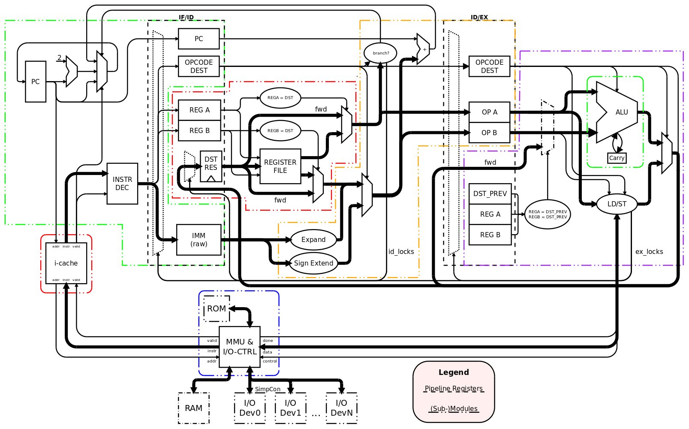

**Another Useless Architecture** (<em>AUA</em>) is a [RISC](http://en.wikipedia.org/wiki/Reduced_Instruction_Set_Computing) [microprocessor](http://en.wikipedia.org/wiki/Microprocessor) architecture developed by Jakob Wilhelm, Stefan Rottensteiner and Stefan Tauner as a course project for the [Computer Architecture Lab](http://en.wikiversity.org/wiki/Computer_Architecture_Lab) at the [Vienna University of Technology](http://en.wikipedia.org/wiki/Vienna_University_of_Technology) in winter 2008/2009. It has been implemented in [VHDL](http://en.wikipedia.org/wiki/VHDL) and tested in a Cyclone II [FPGA](http://en.wikipedia.org/wiki/FPGA) from [Altera](http://en.wikipedia.org/wiki/Altera) on a DE2 development board from Terasic Technology.

# Description

AUA is a 16bit RISC architecture providing 32 registers apparently having
similarities to MIPS. E.g. MIPS branches are supported by individual compare
and branch instructions (i.e. you have to compare two values/registers and use
the result as input for the branch decision). The branch delay is 0 for
untaken and 1 cycle for taken branches. The branch decision and branch address
calculation is done in the ID stage. An additional cycle is lost if the branch
uses the result of the preceding instruction. It is not possible to circumvent
this stall with forwarding as this would introduce a new longest path (from
the ID/EX pipeline registers through the alu, through the branch decision unit
in ID, to the PC register in IF). The EX stage forwards its results to resolve
data hazards in all other instruction sequences though (i.e. if instruction
`n+1` uses the (EX) result of instruction `n` as (EX) input). We used on-chip
memory of the FPGA (M4K blocks) for the register file. As the memory
requires registered inputs, this registers can be regarded as pipeline
registers for the WB stage. To be able to read two registers (the two
operands) and write one (the result of the previous instruction), we had to
duplicate the register file into two "simple dual-port mode" memories. Another
possibility would be to clock the memory twice as fast, but we did prefer a
single clock domain. In dual-port mode the on-chip memory has a latency of 1.5
cycles, which made another forwarding necessary if instr. `n+2` uses the
result of instr. `n`. Beside the branch stall, where IF and (partially) ID
get locked, the EX stage needs to lock all stages, when a load/store operation
takes more than one cycle.

## Memory and I/O

Instructions, data and memory-mapped I/O devices all share the same address
space. The MMU is responsible for handling all memory transactions and
transfers the data to the instruction cache and from/to the load/store unit in
the EX stage. LD/ST transactions have priority over instruction fetches, so
that the pipeline can progress normally. IF will schedule a nop if it is
blocked because the current instr. is not available.

The MMU can access on-board SRAM, on-chip ROM (e.g. for a bootloader) and an
unlimited number of SimpCon devices. They all share the same address space,
which is divided in parts by the MMU. The SimpCon bus is specified as a point-
to-point connection, but it is possible to create a shared SimpCon bus by
connecting every SimpCon slave to an independant `RD` and `WR` line. In the
opposite direction (i.e. from the SC slave to the master) it is necessary to
multiplex `WR_DATA` and `RDY_CNT`, because there are no tri-state buses in
FPGAs (see [Tri-State Buses in Altera
Devices](http://www.altera.com/support/examples/ged/tri_state.html)). Both
tasks are fullfilled by a multiplexer process in the top entity. It matches
the `ADDRESS` similar to IP network masks and selects the corresponding
signals.

## Pipeline stages

AUA has three stages (four if you include write-back): IF, ID, EX/MEM. IF
requests the instruction at the current address/PC from the cache/MMU and
extracts the various fields (opcode, immediate, operand and destinstation
register addresses). These fields get registered and feed into ID.

The immediate field gets expanded _and_ sign extended before a logic block
controls a mux according to the current opcode to choose the correct form of
immediate or drop it altogether in favor of a value read from the register
file. ID also decides, if a branch is taken and if so, which address is next
to be fetched by IF. It is not possible to read the PC directly, but to
support returning from functions, ID can store the PC into a register by
scheduling an ordinary MOV and overriding the source operand with the current
PC value.

EX contains the ALU and a small control curcuit to process LD/ST instructions
in cooperation with the MMU. The result of either the ALU or the MMU is
selected and transfered to the register file (through the ID unit). If the
destination is the zero register, EX enforces a value of 0 to not alter the
register.

## Instruction Cache

It is possible to plug in different instruction cache implementations between
the IF stage and the MMU. Currently a dummy cache (that caches nothing and
just connects the signals between IF and the MMU) and a generic direct-mapped
cache are provided.

The number of lines cached by the direct-mapped cache can be configured.
Currently only on word per cache line is working, because there is no
prefetching done by the MMU. It is planned to change this soon. It is also
planned to use on-chip memory instead of dedicated logic registers for the
cache.

  

# Instruction Set Architecture

The ISA of AUA is typical for a RISC. It was designed with the decoding in
mind: All types of fields (opcode, immediates etc.) have a fixed location in
the fixed-sized instruction word of 16b. One attribute of our architecture
particularly constrained the design of the ISA: We decided that we want 32
registers. This means that out of the 16 bits of one instruction word, 5 bits
are needed to address a register.

Most commands need two input registers and one destination register. We use _2
address encoding_, where one source register is used as the destination too.
This leaves us with at most 6 bits for the opcode, or a maximum of 64
instructions. This number gets reduced by the _ldi_ instruction, because 8b
are needed for the immediate itself plus 5b for the destination register,
leaving `3b` for the _ldi_ opcode. Or in other words `6-3b` are wasted for a
part of the immediate value. These 3 bits can't be used for other
instructions. Since we could not think of 56 useful instructions anyway, we
introduced another type of instruction, that uses immediates.(addi,muli) These
use 7 bits to encode the immediate, wasting 2b of opcode space each. So the
total number of instructions is limited to `2^6 - (2^3-1) - 4*(2^2-1) = 45`.

  

## Instructions

The following table lists all instructions currently implemented in hardware
(see the [pseudo instruction section](#pseudo-instructions) below for the rest). There
are still some white spots, which are reserved for later use. Cells filled
with a **s** form an encoded source register. **d**, **i** likewise for
destination registers and immediates. **a** denotes that the memory address
(e.g. for a branch) is taken from the register encoded by these cells. The
_Imm._ column indicates how immediates are interpreted (e.g. the values used
with branches get sign-extended and can represent forward as well as backward
(=negative) jumps).

<table class="wikitable" style="text-align:center; border:1px solid; line-height:100%" cellspacing="0">
<caption>Table of AUA instructions and their encoding</caption>
<tr>
<th>Mnemo.</th>
<th>Imm.</th>
<th colspan="6"></th>
<th colspan="5">OP B</th>
<th colspan="5">OP A</th>
<th>hex op</th>
<th>notes</th>
</tr>
<tr style="font-size:70%;background:#f2f2f2;line-height:100%">
<td colspan="2"></td>
<td width="15px">15</td>
<td width="15px">14</td>
<td width="15px">13</td>
<td width="15px">12</td>
<td width="15px">11</td>
<td width="15px">10</td>
<td width="15px">9</td>
<td width="15px">8</td>
<td width="15px">7</td>
<td width="15px">6</td>
<td width="15px">5</td>
<td width="15px">4</td>
<td width="15px">3</td>
<td width="15px">2</td>
<td width="15px">1</td>
<td width="15px">0</td>
<td colspan="2"></td>
</tr>
<tr>
<td style="text-align: left">ldi</td>
<td>unsigned</td>
<td>0</td>
<td>0</td>
<td>0</td>
<td>i</td>
<td>i</td>
<td>i</td>
<td>i</td>
<td>i</td>
<td>i</td>
<td>i</td>
<td>i</td>
<td>d</td>
<td>d</td>
<td>d</td>
<td>d</td>
<td>d</td>
<td style="text-align: right">0x00-0x07</td>
<td></td>
</tr>
<tr>
<td></td>
<td></td>
<td>0</td>
<td>0</td>
<td>1</td>
<td>0</td>
<td>0</td>
<td>0</td>
<td></td>
<td></td>
<td></td>
<td></td>
<td></td>
<td></td>
<td></td>
<td></td>
<td></td>
<td></td>
<td style="text-align: right">0x08</td>
<td></td>
</tr>
<tr>
<td></td>
<td></td>
<td>0</td>
<td>0</td>
<td>1</td>
<td>0</td>
<td>0</td>
<td>1</td>
<td></td>
<td></td>
<td></td>
<td></td>
<td></td>
<td></td>
<td></td>
<td></td>
<td></td>
<td></td>
<td style="text-align: right">0x09</td>
<td></td>
</tr>
<tr>
<td></td>
<td></td>
<td>0</td>
<td>0</td>
<td>1</td>
<td>0</td>
<td>1</td>
<td>0</td>
<td></td>
<td></td>
<td></td>
<td></td>
<td></td>
<td></td>
<td></td>
<td></td>
<td></td>
<td></td>
<td style="text-align: right">0x0A</td>
<td></td>
</tr>
<tr>
<td></td>
<td></td>
<td>0</td>
<td>0</td>
<td>1</td>
<td>0</td>
<td>1</td>
<td>1</td>
<td></td>
<td></td>
<td></td>
<td></td>
<td></td>
<td></td>
<td></td>
<td></td>
<td></td>
<td></td>
<td style="text-align: right">0x0B</td>
<td></td>
</tr>
<tr>
<td></td>
<td></td>
<td>0</td>
<td>0</td>
<td>1</td>
<td>1</td>
<td>0</td>
<td>0</td>
<td></td>
<td></td>
<td></td>
<td></td>
<td></td>
<td></td>
<td></td>
<td></td>
<td></td>
<td></td>
<td style="text-align: right">0x0C</td>
<td></td>
</tr>
<tr>
<td style="text-align: left">jmpl</td>
<td></td>
<td>0</td>
<td>0</td>
<td>1</td>
<td>1</td>
<td>0</td>
<td>1</td>
<td>a</td>
<td>a</td>
<td>a</td>
<td>a</td>
<td>a</td>
<td></td>
<td></td>
<td></td>
<td></td>
<td></td>
<td style="text-align: right">0x0D</td>
<td></td>
</tr>
<tr>
<td style="text-align: left">brez</td>
<td></td>
<td>0</td>
<td>0</td>
<td>1</td>
<td>1</td>
<td>1</td>
<td>0</td>
<td>a</td>
<td>a</td>
<td>a</td>
<td>a</td>
<td>a</td>
<td>s</td>
<td>s</td>
<td>s</td>
<td>s</td>
<td>s</td>
<td style="text-align: right">0x0E</td>
<td></td>
</tr>
<tr>
<td style="text-align: left">brnez</td>
<td></td>
<td>0</td>
<td>0</td>
<td>1</td>
<td>1</td>
<td>1</td>
<td>1</td>
<td>a</td>
<td>a</td>
<td>a</td>
<td>a</td>
<td>a</td>
<td>s</td>
<td>s</td>
<td>s</td>
<td>s</td>
<td>s</td>
<td style="text-align: right">0x0F</td>
<td></td>
</tr>
<tr>
<td style="text-align: left">brezi</td>
<td>signed</td>
<td>0</td>
<td>1</td>
<td>0</td>
<td>0</td>
<td>i</td>
<td>i</td>
<td>i</td>
<td>i</td>
<td>i</td>
<td>i</td>
<td>i</td>
<td>s</td>
<td>s</td>
<td>s</td>
<td>s</td>
<td>s</td>
<td style="text-align: right">0x10-0x13</td>
<td></td>
</tr>
<tr>
<td style="text-align: left">brnezi</td>
<td>signed</td>
<td>0</td>
<td>1</td>
<td>0</td>
<td>1</td>
<td>i</td>
<td>i</td>
<td>i</td>
<td>i</td>
<td>i</td>
<td>i</td>
<td>i</td>
<td>s</td>
<td>s</td>
<td>s</td>
<td>s</td>
<td>s</td>
<td style="text-align: right">0x14-0x17</td>
<td></td>
</tr>
<tr>
<td style="text-align: left">addi</td>
<td>signed</td>
<td>0</td>
<td>1</td>
<td>1</td>
<td>0</td>
<td>i</td>
<td>i</td>
<td>i</td>
<td>i</td>
<td>i</td>
<td>i</td>
<td>i</td>
<td>d</td>
<td>d</td>
<td>d</td>
<td>d</td>
<td>d</td>
<td style="text-align: right">0x18-0x1B</td>
<td>sets carry</td>
</tr>
<tr>
<td style="text-align: left">muli</td>
<td>signed</td>
<td>0</td>
<td>1</td>
<td>1</td>
<td>1</td>
<td>i</td>
<td>i</td>
<td>i</td>
<td>i</td>
<td>i</td>
<td>i</td>
<td>i</td>
<td>d</td>
<td>d</td>
<td>d</td>
<td>d</td>
<td>d</td>
<td style="text-align: right">0x1C-0x1F</td>
<td></td>
</tr>
<tr>
<td style="text-align: left">add</td>
<td></td>
<td>1</td>
<td>0</td>
<td>0</td>
<td>0</td>
<td>0</td>
<td>0</td>
<td>s</td>
<td>s</td>
<td>s</td>
<td>s</td>
<td>s</td>
<td>d</td>
<td>d</td>
<td>d</td>
<td>d</td>
<td>d</td>
<td style="text-align: right">0x20</td>
<td>sets carry</td>
</tr>
<tr>
<td style="text-align: left">addc</td>
<td></td>
<td>1</td>
<td>0</td>
<td>0</td>
<td>0</td>
<td>0</td>
<td>1</td>
<td>s</td>
<td>s</td>
<td>s</td>
<td>s</td>
<td>s</td>
<td>d</td>
<td>d</td>
<td>d</td>
<td>d</td>
<td>d</td>
<td style="text-align: right">0x21</td>
<td>sets carry</td>
</tr>
<tr>
<td style="text-align: left">sub</td>
<td></td>
<td>1</td>
<td>0</td>
<td>0</td>
<td>0</td>
<td>1</td>
<td>0</td>
<td>s</td>
<td>s</td>
<td>s</td>
<td>s</td>
<td>s</td>
<td>d</td>
<td>d</td>
<td>d</td>
<td>d</td>
<td>d</td>
<td style="text-align: right">0x22</td>
<td>sets carry</td>
</tr>
<tr>
<td style="text-align: left">subc</td>
<td></td>
<td>1</td>
<td>0</td>
<td>0</td>
<td>0</td>
<td>1</td>
<td>1</td>
<td>s</td>
<td>s</td>
<td>s</td>
<td>s</td>
<td>s</td>
<td>d</td>
<td>d</td>
<td>d</td>
<td>d</td>
<td>d</td>
<td style="text-align: right">0x23</td>
<td>sets carry</td>
</tr>
<tr>
<td style="text-align: left">mul</td>
<td></td>
<td>1</td>
<td>0</td>
<td>0</td>
<td>1</td>
<td>0</td>
<td>0</td>
<td>s</td>
<td>s</td>
<td>s</td>
<td>s</td>
<td>s</td>
<td>d</td>
<td>d</td>
<td>d</td>
<td>d</td>
<td>d</td>
<td style="text-align: right">0x24</td>
<td></td>
</tr>
<tr>
<td style="text-align: left">mulu</td>
<td></td>
<td>1</td>
<td>0</td>
<td>0</td>
<td>1</td>
<td>0</td>
<td>1</td>
<td>s</td>
<td>s</td>
<td>s</td>
<td>s</td>
<td>s</td>
<td>d</td>
<td>d</td>
<td>d</td>
<td>d</td>
<td>d</td>
<td style="text-align: right">0x25</td>
<td></td>
</tr>
<tr>
<td style="text-align: left">mulh</td>
<td></td>
<td>1</td>
<td>0</td>
<td>0</td>
<td>1</td>
<td>1</td>
<td>0</td>
<td>s</td>
<td>s</td>
<td>s</td>
<td>s</td>
<td>s</td>
<td>d</td>
<td>d</td>
<td>d</td>
<td>d</td>
<td>d</td>
<td style="text-align: right">0x26</td>
<td></td>
</tr>
<tr>
<td style="text-align: left">mulhu</td>
<td></td>
<td>1</td>
<td>0</td>
<td>0</td>
<td>1</td>
<td>1</td>
<td>1</td>
<td>s</td>
<td>s</td>
<td>s</td>
<td>s</td>
<td>s</td>
<td>d</td>
<td>d</td>
<td>d</td>
<td>d</td>
<td>d</td>
<td style="text-align: right">0x27</td>
<td></td>
</tr>
<tr>
<td style="text-align: left">or</td>
<td></td>
<td>1</td>
<td>0</td>
<td>1</td>
<td>0</td>
<td>0</td>
<td>0</td>
<td>s</td>
<td>s</td>
<td>s</td>
<td>s</td>
<td>s</td>
<td>d</td>
<td>d</td>
<td>d</td>
<td>d</td>
<td>d</td>
<td style="text-align: right">0x28</td>
<td></td>
</tr>
<tr>
<td style="text-align: left">and</td>
<td></td>
<td>1</td>
<td>0</td>
<td>1</td>
<td>0</td>
<td>0</td>
<td>1</td>
<td>s</td>
<td>s</td>
<td>s</td>
<td>s</td>
<td>s</td>
<td>d</td>
<td>d</td>
<td>d</td>
<td>d</td>
<td>d</td>
<td style="text-align: right">0x29</td>
<td></td>
</tr>
<tr>
<td style="text-align: left">xor</td>
<td></td>
<td>1</td>
<td>0</td>
<td>1</td>
<td>0</td>
<td>1</td>
<td>0</td>
<td>s</td>
<td>s</td>
<td>s</td>
<td>s</td>
<td>s</td>
<td>d</td>
<td>d</td>
<td>d</td>
<td>d</td>
<td>d</td>
<td style="text-align: right">0x2A</td>
<td></td>
</tr>
<tr>
<td style="text-align: left">not</td>
<td></td>
<td>1</td>
<td>0</td>
<td>1</td>
<td>0</td>
<td>1</td>
<td>1</td>
<td>s</td>
<td>s</td>
<td>s</td>
<td>s</td>
<td>s</td>
<td>d</td>
<td>d</td>
<td>d</td>
<td>d</td>
<td>d</td>
<td style="text-align: right">0x2B</td>
<td></td>
</tr>
<tr>
<td style="text-align: left">neg</td>
<td></td>
<td>1</td>
<td>0</td>
<td>1</td>
<td>1</td>
<td>0</td>
<td>0</td>
<td>s</td>
<td>s</td>
<td>s</td>
<td>s</td>
<td>s</td>
<td>d</td>
<td>d</td>
<td>d</td>
<td>d</td>
<td>d</td>
<td style="text-align: right">0x2C</td>
<td></td>
</tr>
<tr>
<td style="text-align: left">asr</td>
<td></td>
<td>1</td>
<td>0</td>
<td>1</td>
<td>1</td>
<td>0</td>
<td>1</td>
<td>s</td>
<td>s</td>
<td>s</td>
<td>s</td>
<td>s</td>
<td>d</td>
<td>d</td>
<td>d</td>
<td>d</td>
<td>d</td>
<td style="text-align: right">0x2D</td>
<td></td>
</tr>
<tr>
<td style="text-align: left">lsl</td>
<td></td>
<td>1</td>
<td>0</td>
<td>1</td>
<td>1</td>
<td>1</td>
<td>0</td>
<td>s</td>
<td>s</td>
<td>s</td>
<td>s</td>
<td>s</td>
<td>d</td>
<td>d</td>
<td>d</td>
<td>d</td>
<td>d</td>
<td style="text-align: right">0x2E</td>
<td></td>
</tr>
<tr>
<td style="text-align: left">lsr</td>
<td></td>
<td>1</td>
<td>0</td>
<td>1</td>
<td>1</td>
<td>1</td>
<td>1</td>
<td>s</td>
<td>s</td>
<td>s</td>
<td>s</td>
<td>s</td>
<td>d</td>
<td>d</td>
<td>d</td>
<td>d</td>
<td>d</td>
<td style="text-align: right">0x2F</td>
<td></td>
</tr>
<tr>
<td style="text-align: left">lsli</td>
<td>unsigned</td>
<td>1</td>
<td>1</td>
<td>0</td>
<td>0</td>
<td>0</td>
<td>0</td>
<td></td>
<td>i</td>
<td>i</td>
<td>i</td>
<td>i</td>
<td>d</td>
<td>d</td>
<td>d</td>
<td>d</td>
<td>d</td>
<td style="text-align: right">0x30</td>
<td></td>
</tr>
<tr>
<td style="text-align: left">lsri</td>
<td>unsigned</td>
<td>1</td>
<td>1</td>
<td>0</td>
<td>0</td>
<td>0</td>
<td>1</td>
<td></td>
<td>i</td>
<td>i</td>
<td>i</td>
<td>i</td>
<td>d</td>
<td>d</td>
<td>d</td>
<td>d</td>
<td>d</td>
<td style="text-align: right">0x31</td>
<td></td>
</tr>
<tr>
<td style="text-align: left">scb</td>
<td>unsigned</td>
<td>1</td>
<td>1</td>
<td>0</td>
<td>0</td>
<td>1</td>
<td>0</td>
<td>k</td>
<td>i</td>
<td>i</td>
<td>i</td>
<td>i</td>
<td>d</td>
<td>d</td>
<td>d</td>
<td>d</td>
<td>d</td>
<td style="text-align: right">0x32</td>
<td>k=set/!clear</td>
</tr>
<tr>
<td style="text-align: left">roti</td>
<td>unsigned</td>
<td>1</td>
<td>1</td>
<td>0</td>
<td>0</td>
<td>1</td>
<td>1</td>
<td>k</td>
<td>i</td>
<td>i</td>
<td>i</td>
<td>i</td>
<td>d</td>
<td>d</td>
<td>d</td>
<td>d</td>
<td>d</td>
<td style="text-align: right">0x33</td>
<td>k=left/!left</td>
</tr>
<tr>
<td style="text-align: left">cmplt</td>
<td></td>
<td>1</td>
<td>1</td>
<td>0</td>
<td>1</td>
<td>0</td>
<td>0</td>
<td>s</td>
<td>s</td>
<td>s</td>
<td>s</td>
<td>s</td>
<td>s</td>
<td>s</td>
<td>s</td>
<td>s</td>
<td>s</td>
<td style="text-align: right">0x34</td>
<td></td>
</tr>
<tr>
<td style="text-align: left">cmpltu</td>
<td></td>
<td>1</td>
<td>1</td>
<td>0</td>
<td>1</td>
<td>0</td>
<td>1</td>
<td>s</td>
<td>s</td>
<td>s</td>
<td>s</td>
<td>s</td>
<td>s</td>
<td>s</td>
<td>s</td>
<td>s</td>
<td>s</td>
<td style="text-align: right">0x35</td>
<td></td>
</tr>
<tr>
<td style="text-align: left">cmplte</td>
<td></td>
<td>1</td>
<td>1</td>
<td>0</td>
<td>1</td>
<td>1</td>
<td>0</td>
<td>s</td>
<td>s</td>
<td>s</td>
<td>s</td>
<td>s</td>
<td>s</td>
<td>s</td>
<td>s</td>
<td>s</td>
<td>s</td>
<td style="text-align: right">0x36</td>
<td></td>
</tr>
<tr>
<td style="text-align: left">cmplteu</td>
<td></td>
<td>1</td>
<td>1</td>
<td>0</td>
<td>1</td>
<td>1</td>
<td>1</td>
<td>s</td>
<td>s</td>
<td>s</td>
<td>s</td>
<td>s</td>
<td>s</td>
<td>s</td>
<td>s</td>
<td>s</td>
<td>s</td>
<td style="text-align: right">0x37</td>
<td></td>
</tr>
<tr>
<td style="text-align: left">cmpe</td>
<td></td>
<td>1</td>
<td>1</td>
<td>1</td>
<td>0</td>
<td>0</td>
<td>0</td>
<td>s</td>
<td>s</td>
<td>s</td>
<td>s</td>
<td>s</td>
<td>s</td>
<td>s</td>
<td>s</td>
<td>s</td>
<td>s</td>
<td style="text-align: right">0x38</td>
<td></td>
</tr>
<tr>
<td style="text-align: left">cmpei</td>
<td>unsigned</td>
<td>1</td>
<td>1</td>
<td>1</td>
<td>0</td>
<td>0</td>
<td>1</td>
<td>i</td>
<td>i</td>
<td>i</td>
<td>i</td>
<td>i</td>
<td>d</td>
<td>d</td>
<td>d</td>
<td>d</td>
<td>d</td>
<td style="text-align: right">0x39</td>
<td></td>
</tr>
<tr>
<td style="text-align: left"></td>
<td></td>
<td>1</td>
<td>1</td>
<td>1</td>
<td>0</td>
<td>1</td>
<td>0</td>
<td></td>
<td></td>
<td></td>
<td></td>
<td></td>
<td></td>
<td></td>
<td></td>
<td></td>
<td></td>
<td style="text-align: right">0x3A</td>
<td></td>
</tr>
<tr>
<td style="text-align: left">mov</td>
<td></td>
<td>1</td>
<td>1</td>
<td>1</td>
<td>0</td>
<td>1</td>
<td>1</td>
<td>s</td>
<td>s</td>
<td>s</td>
<td>s</td>
<td>s</td>
<td>d</td>
<td>d</td>
<td>d</td>
<td>d</td>
<td>d</td>
<td style="text-align: right">0x3B</td>
<td></td>
</tr>
<tr>
<td style="text-align: left">ld</td>
<td></td>
<td>1</td>
<td>1</td>
<td>1</td>
<td>1</td>
<td>0</td>
<td>0</td>
<td>a</td>
<td>a</td>
<td>a</td>
<td>a</td>
<td>a</td>
<td>d</td>
<td>d</td>
<td>d</td>
<td>d</td>
<td>d</td>
<td style="text-align: right">0x3C</td>
<td></td>
</tr>
<tr>
<td style="text-align: left">ldb</td>
<td></td>
<td>1</td>
<td>1</td>
<td>1</td>
<td>1</td>
<td>0</td>
<td>1</td>
<td>a</td>
<td>a</td>
<td>a</td>
<td>a</td>
<td>a</td>
<td>d</td>
<td>d</td>
<td>d</td>
<td>d</td>
<td>d</td>
<td style="text-align: right">0x3D</td>
<td></td>
</tr>
<tr>
<td style="text-align: left">st</td>
<td></td>
<td>1</td>
<td>1</td>
<td>1</td>
<td>1</td>
<td>1</td>
<td>0</td>
<td>a</td>
<td>a</td>
<td>a</td>
<td>a</td>
<td>a</td>
<td>s</td>
<td>s</td>
<td>s</td>
<td>s</td>
<td>s</td>
<td style="text-align: right">0x3E</td>
<td></td>
</tr>
<tr>
<td style="text-align: left">stb</td>
<td></td>
<td>1</td>
<td>1</td>
<td>1</td>
<td>1</td>
<td>1</td>
<td>1</td>
<td>a</td>
<td>a</td>
<td>a</td>
<td>a</td>
<td>a</td>
<td>s</td>
<td>s</td>
<td>s</td>
<td>s</td>
<td>s</td>
<td style="text-align: right">0x3F</td>
<td></td>
</tr>
<tr style="font-size:70%;background:#f2f2f2;line-height:100%">
<td colspan="2"></td>
<td width="15px">15</td>
<td width="15px">14</td>
<td width="15px">13</td>
<td width="15px">12</td>
<td width="15px">11</td>
<td width="15px">10</td>
<td width="15px">9</td>
<td width="15px">8</td>
<td width="15px">7</td>
<td width="15px">6</td>
<td width="15px">5</td>
<td width="15px">4</td>
<td width="15px">3</td>
<td width="15px">2</td>
<td width="15px">1</td>
<td width="15px">0</td>
<td colspan="2"></td>
</tr>
<tr>
<th colspan="8"></th>
<th colspan="5">OP B</th>
<th colspan="5">OP A</th>
<th colspan="2"></th>
</tr>
</table>
**ldi – Load Immediate (signed, byte)**

<table border="1" cellspacing="0" cellpadding="2" style="border-collapse:collapse;">
<tr>
<td>Operation</td>
<td>Syntax</td>
<td>Operands</td>
</tr>
<tr>
<td>Rd &lt;-- Imm(byte)</td>
<td>LDI Rd, Imm</td>
<td>Imm ... 8bit signed Immediate</td>
</tr>
<tr>
<td></td>
<td></td>
<td>Rd ... Destinationregister</td>
</tr>
</table>

Load an 8 bit signed immediate to the Low Byte of Register Rd

  
**jmpl – Jump and Link**

<table border="1" cellspacing="0" cellpadding="2" style="border-collapse:collapse;">
<tr>
<td>Operation</td>
<td>Syntax</td>
<td>Operands</td>
</tr>
<tr>
<td>PC &lt;-- Addr, R31 &lt;-- PC</td>
<td>JMPL Rs</td>
<td>Rs... Register contains the address to jump</td>
</tr>
</table>

Jump to the Addr

  
**brez – Branch if Equal Zero**

<table border="1" cellspacing="0" cellpadding="2" style="border-collapse:collapse;">
<tr>
<td>Operation</td>
<td>Syntax</td>
</tr>
<tr>
<td>if Rs = 0 then PC &lt;-- Addr 
else PC &lt;-- PC + 16</td>
<td>BREZ Addr, Rs</td>
</tr>
</table>

Branch to the Addr if the content of Rs is equal to zero

  
**brnez – Branch if Not Equal Zero**

<table border="1" cellspacing="0" cellpadding="2" style="border-collapse:collapse;">
<tr>
<td>Operation</td>
<td>Syntax</td>
</tr>
<tr>
<td>if Rs&#160;!= 0 then PC &lt;-- Addr 
else PC &lt;-- PC + 16</td>
<td>BRNEZ Addr, Rs</td>
</tr>
</table>

Branch to the Addr if the content of Rs is not equal to zero

  
**brezi – Branch if Equal Zero Immediate**

<table border="1" cellspacing="0" cellpadding="2" style="border-collapse:collapse;">
<tr>
<td>Operation</td>
<td>Syntax</td>
<td>Operands</td>
</tr>
<tr>
<td>if Imm = 0 then PC &lt;-- Addr 
else PC &lt;-- PC + 16</td>
<td>Brezi Addr, Imm</td>
<td>Imm ... 7 bit signed Immediate</td>
</tr>
</table>

Branch to the Addr if the imm is equal to zero

  
**brnezi – Branch if Not Equal Zero Immediate**

<table border="1" cellspacing="0" cellpadding="2" style="border-collapse:collapse;">
<tr>
<td>Operation</td>
<td>Syntax</td>
<td>Operands</td>
</tr>
<tr>
<td>if Imm&#160;!= 0 then PC &lt;-- Addr 
else PC &lt;-- PC + 16</td>
<td>BRNEZI Addr Imm</td>
<td>Imm...7 bit signed Immediate</td>
</tr>
</table>

Branch to the Addr if the imm is not equal to zero

  
**Addi – Add Immediate**

<table border="1" cellspacing="0" cellpadding="2" style="border-collapse:collapse;">
<tr>
<td>Operation</td>
<td>Syntax</td>
<td>Operands</td>
</tr>
<tr>
<td>Rd &lt;-- Rd + Imm</td>
<td>ADDI Rd, Imm</td>
<td>Imm ... 7 bit signed Immediate</td>
</tr>
</table>

Add an 7 bit signed Immediate to Rd and wirite the result back to Rd

  
**Muli – Multiply Immediate**

<table border="1" cellspacing="0" cellpadding="2" style="border-collapse:collapse;">
<tr>
<td>Operation</td>
<td>Syntax</td>
<td>Operands</td>
</tr>
<tr>
<td>Rd &lt;-- Rd * Imm</td>
<td>MULI Rd,Imm</td>
<td>Imm ... 7 bit signed Immediate</td>
</tr>
</table>

Multiply an 7 bit signed Immediate with Rd and wirite the result back to Rd
After execution, Rd holds the low word of the multiplication.

  
**Add – Add without carry**

<table border="1" cellspacing="0" cellpadding="2" style="border-collapse:collapse;">
<tr>
<td>Operation</td>
<td>Syntax</td>
<td>Operands</td>
</tr>
<tr>
<td>Rd &lt;-- Rd + Rs</td>
<td>ADD Rd, Rs</td>
<td>Rd, Rs signed interpreted</td>
</tr>
</table>

Add the content of register Rs to register Rd and write the result back to Rd

Carrybit is set, if an overflow occurred

  
**Addc – Add with Carry**

<table border="1" cellspacing="0" cellpadding="2" style="border-collapse:collapse;">
<tr>
<td>Operation</td>
<td>Syntax</td>
<td>Operands</td>
</tr>
<tr>
<td>Rd &lt;-- Rd + Rs + C</td>
<td>ADDC Rd, Rs</td>
<td>Rd, Rs signed interpreted</td>
</tr>
</table>

Add Carrybit and content of Rs to Rd and write the result back to Rd

Carrybit is set if result greater than max. value otherwise cleared.

  
**Sub – Sub without carry**

<table border="1" cellspacing="0" cellpadding="2" style="border-collapse:collapse;">
<tr>
<td>Operation</td>
<td>Syntax</td>
<td>Operands</td>
</tr>
<tr>
<td>Rd &lt;-- Rd - Rs</td>
<td>SUB Rd, Rs</td>
<td>Rd, Rs signed interpreted</td>
</tr>
</table>

Subtract the content of register Rs from register Rd and write the result back
to Rd

Carrybit is set, if an overflow occurred

  
**Subc – Sub with Carry**

<table border="1" cellspacing="0" cellpadding="2" style="border-collapse:collapse;">
<tr>
<td>Operation</td>
<td>Syntax</td>
<td>Operands</td>
</tr>
<tr>
<td>Rd &lt;-- Rd - Rs - C</td>
<td>SUBC Rd, Rs</td>
<td>Rd, Rs signed interpreted</td>
</tr>
</table>

Subtract Carrybit and content of Rs from Rd and write the result back to Rd

Carrybit is set if result less than min. value, otherwise cleared.

  
**Mul – Multiply low word signed**

<table border="1" cellspacing="0" cellpadding="2" style="border-collapse:collapse;">
<tr>
<td>Operation</td>
<td>Syntax</td>
<td>Operands</td>
</tr>
<tr>
<td>Rd &lt;-- Rd x Rs</td>
<td>MUL Rd, Rs</td>
<td>Rd, Rs signed interpreted</td>
</tr>
</table>

Multiply the content of Rs and Rd signe-interpreted and write the result back
to Rd.

After execution, Rd holds the low word of the multiplication.

  
**Mulu – Multiply low word Unsigned**

<table border="1" cellspacing="0" cellpadding="2" style="border-collapse:collapse;">
<tr>
<td>Operation</td>
<td>Syntax</td>
<td>Operands</td>
</tr>
<tr>
<td>Rd &lt;-- Rd x Rs</td>
<td>MULU Rd, Rs</td>
<td>Rd, Rs unsigned interpreted</td>
</tr>
</table>

Multiply content of Rs and Rd unsigne-interpreted and write the result back to
Rd.

After execution, Rd holds the low word of the multiplication.

  
**Mulh – Multiply High word signed**

<table border="1" cellspacing="0" cellpadding="2" style="border-collapse:collapse;">
<tr>
<td>Operation</td>
<td>Syntax</td>
<td>Operands</td>
</tr>
<tr>
<td>Rd &lt;-- Rd x Rs</td>
<td>MULH Rd, Rs</td>
<td>Rd, Rs signed interpreted</td>
</tr>
</table>

Multiply the content of Rs and Rd signe-interpreted and write the result back
to Rd.

After execution, Rd holds the high word of the multiplication.

  
**Mulhu – Multiply High word Unsigned**

<table border="1" cellspacing="0" cellpadding="2" style="border-collapse:collapse;">
<tr>
<td>Operation</td>
<td>Syntax</td>
<td>Operands</td>
</tr>
<tr>
<td>Rd &lt;-- Rd x Rs</td>
<td>MULHU Rd, Rs</td>
<td>Rd, Rs unsigned interpreted</td>
</tr>
</table>

Multiply content of Rs and Rd unsigne-interpreted and write the result back to
Rd.

After execution, Rd holds the high word of the multiplication.

  
**Or – Logical Or**

<table border="1" cellspacing="0" cellpadding="2" style="border-collapse:collapse;">
<tr>
<td>Operation</td>
<td>Syntax</td>
</tr>
<tr>
<td>Rd &lt;-- Rd or Rs</td>
<td>OR Rd, Rs</td>
</tr>
</table>

Bitwise or combination of the two registers content, and write result back to
Rd

  
**And – Logical And**

<table border="1" cellspacing="0" cellpadding="2" style="border-collapse:collapse;">
<tr>
<td>Operation</td>
<td>Syntax</td>
</tr>
<tr>
<td>Rd &lt;-- Rd and Rs</td>
<td>AND Rd, Rs</td>
</tr>
</table>

Bitwise and combination of the two registers content, and write result back to
Rd

  
**Xor – Logical Xor**

<table border="1" cellspacing="0" cellpadding="2" style="border-collapse:collapse;">
<tr>
<td>Operation</td>
<td>Syntax</td>
</tr>
<tr>
<td>Rd &lt;-- Rd xor Rs</td>
<td>XOR Rd, Rs</td>
</tr>
</table>

Bitwise xor combination of the two registers content, and write result back to
Rd

  
**Not – Invert register**

<table border="1" cellspacing="0" cellpadding="2" style="border-collapse:collapse;">
<tr>
<td>Operation</td>
<td>Syntax</td>
</tr>
<tr>
<td>Rd &lt;-- not Rs</td>
<td>NOT Rd, Rs</td>
</tr>
</table>

Invert the bits of Rs, and write the result to Rd.

  
**Neg – Negate (2er-Complement)**

<table border="1" cellspacing="0" cellpadding="2" style="border-collapse:collapse;">
<tr>
<td>Operation</td>
<td>Syntax</td>
</tr>
<tr>
<td>Rd &lt;-- +/- Rs</td>
<td>NEG Rd, Rs</td>
</tr>
</table>

Calculate the Two'ers Complement of Rs and write the result to Rd.

For the max. negative value, the result is the max. negative value again

  
**Asr – Aritmethic Shift Right**

<table border="1" cellspacing="0" cellpadding="2" style="border-collapse:collapse;">
<tr>
<td>Operation</td>
<td>Syntax</td>
</tr>
<tr>
<td>Rd &lt;-- (b15),(1&gt;&gt;Rs)</td>
<td>ASR Rd</td>
</tr>
</table>

Hold MSB and shift all bits in Rd one bit to the right.

LSB is shifted out.

  
**Lsl – Logical Shift Left**

<table border="1" cellspacing="0" cellpadding="2" style="border-collapse:collapse;">
<tr>
<td>Operation</td>
<td>Syntax</td>
</tr>
<tr>
<td>Rd &lt;-- (Rd &lt;&lt; 1)</td>
<td>LSL Rd</td>
</tr>
</table>

Shift all bits in Rd to the left. MSB is shifted out, LSB is cleared.

  
**Lsr – Logical Shift Right**

<table border="1" cellspacing="0" cellpadding="2" style="border-collapse:collapse;">
<tr>
<td>Operation</td>
<td>Syntax</td>
</tr>
<tr>
<td>Rd &lt;-- (1 &gt;&gt; Rd)</td>
<td>LSR Rd</td>
</tr>
</table>

Shift all bits in Rd to the right. MSB is cleared, LSB is shifted out.

  
**Lsli – Logical ShiftLeft Immediate**

<table border="1" cellspacing="0" cellpadding="2" style="border-collapse:collapse;">
<tr>
<td>Operation</td>
<td>Syntax</td>
<td>Operands</td>
</tr>
<tr>
<td>Rd &lt;-- (Rd &lt;&lt; Imm)</td>
<td>LSLI Rd,Imm</td>
<td>Imm is unsigned interpreted</td>
</tr>
</table>

Shift all bits about the given value to the left. MSB is shifted out, LSB is
cleared.

Immediate is 4 bits long and interpreted as unsigned

  
**Lsri – Logical Shift Right Immediate**

<table border="1" cellspacing="0" cellpadding="2" style="border-collapse:collapse;">
<tr>
<td>Operation</td>
<td>Syntax</td>
<td>Operands</td>
</tr>
<tr>
<td>Rd &lt;-- (Imm &gt;&gt; Rd)</td>
<td>LSRI Rd,Imm</td>
<td>Imm is unsigned interpreted</td>
</tr>
</table>

Shift all bits about the given value to the right. MSB is cleared, LSB is
shifted out.

Immediate is 4 bits long and interpreted as unsigned

  
**Scb – Set/Clear Bit**

<table border="1" cellspacing="0" cellpadding="2" style="border-collapse:collapse;">
<tr>
<td>Operation</td>
<td>Syntax</td>
<td>Operands</td>
</tr>
<tr>
<td>Rd &lt;-- Rd(bitx)&lt;--1/0</td>
<td>SCB Rd,Imm</td>
<td>Imm is unsigned interpreted</td>
</tr>
<tr>
<td></td>
<td></td>
<td>Bit(4) = 1 = set, Bit(4) = 0 = clear</td>
</tr>
<tr>
<td></td>
<td></td>
<td>Bit(3to0) = position</td>
</tr>
</table>

Bit 3 to bit 0 of immediate indicates which bit in Rd should be set or cleared

If bit 4 is 1, bit is set otherwise cleared.

  
**Roti – Rotate right/left about an Immediate**

<table border="1" cellspacing="0" cellpadding="2" style="border-collapse:collapse;">
<tr>
<td>Operation</td>
<td>Syntax</td>
<td>Operands</td>
</tr>
<tr>
<td>Rd(b14..b0,b15) &lt;--Rd(b15...b0) if dir = 0</td>
<td>ROTI Rd, Imm</td>
<td>Imm is unsigned interpreted</td>
</tr>
<tr>
<td>Rd(b0..b15,b1) &lt;--Rd(b15...b0) if dir = 0</td>
<td></td>
<td>Bit(4) = 1 = right, Bit(4) = 0 = left</td>
</tr>
<tr>
<td></td>
<td></td>
<td>Bit(3to0) = digits to move</td>
</tr>
</table>

Bit 3 to bit 0 of immediate indicates the length to rotate bits in Rd.

if bit4 is 1, rotate right, otherwise rotate left.

  
**Cmplt – Compare Less Than**

<table border="1" cellspacing="0" cellpadding="2" style="border-collapse:collapse;">
<tr>
<td>Operation</td>
<td>Syntax</td>
<td>Operands</td>
</tr>
<tr>
<td>Rd &lt;-- Rd &lt; Rs &lt;--1/0</td>
<td>CMPLT Rd, Rs</td>
<td>Rd, Rs signed interpreted</td>
</tr>
</table>

Test if Rd < Rs

If true write 1 to Rd otherwise 0

  
**Cmpltu – Compare Less Than Unsigned**

<table border="1" cellspacing="0" cellpadding="2" style="border-collapse:collapse;">
<tr>
<td>Operation</td>
<td>Syntax</td>
<td>Operands</td>
</tr>
<tr>
<td>Rd &lt;-- Rd &lt; Rs &lt;--1/0</td>
<td>CMPLTU Rd, Rs</td>
<td>Rd, Rs unsigned interpreted</td>
</tr>
</table>

Test if Rd < Rs

If true write 1 to Rd otherwise 0

  
**Cmplte – Compare Less Than Equal**

<table border="1" cellspacing="0" cellpadding="2" style="border-collapse:collapse;">
<tr>
<td>Operation</td>
<td>Syntax</td>
<td>Operands</td>
</tr>
<tr>
<td>Rd &lt;-- Rd &lt;= Rs &lt;--1/0</td>
<td>CMPLTE Rd, Rs</td>
<td>Rd, Rs signed interpreted</td>
</tr>
</table>

Test if Rd <= Rs

If true write 1 to Rd otherwise 0

  
**Cmplteu – Compare Less Than Equal Unsigned**

<table border="1" cellspacing="0" cellpadding="2" style="border-collapse:collapse;">
<tr>
<td>Operation</td>
<td>Syntax</td>
<td>Operands</td>
</tr>
<tr>
<td>Rd &lt;-- Rd &lt;= Rs &lt;--1/0</td>
<td>CMPLTEU Rd, Rs</td>
<td>Rd, Rs unsigned interpreted</td>
</tr>
</table>

Test if Rd <= Rs

If true write 1 to Rd otherwise 0

  
**Cmpe – Compare Equal**

<table border="1" cellspacing="0" cellpadding="2" style="border-collapse:collapse;">
<tr>
<td>Operation</td>
<td>Syntax</td>
</tr>
<tr>
<td>Rd &lt;-- Rd = Rs &lt;--1/0</td>
<td>CMPE Rd, Rs</td>
</tr>
</table>

Test if Rd = Rs

If true write 1 to Rd otherwise 0

  
**Cmpei – Compare Equal Immediate**

<table border="1" cellspacing="0" cellpadding="2" style="border-collapse:collapse;">
<tr>
<td>Operation</td>
<td>Syntax</td>
</tr>
<tr>
<td>Rd &lt;-- Rd = IMM &lt;--1/0</td>
<td>CMPEI Rd, Imm</td>
</tr>
</table>

Test if Rd = Imm

If true write 1 to Rd otherwise 0

  
**Mov – Copy Registercontent**

<table border="1" cellspacing="0" cellpadding="2" style="border-collapse:collapse;">
<tr>
<td>Operation</td>
<td>Syntax</td>
</tr>
<tr>
<td>Rd &lt;-- Rs</td>
<td>MOV Rd, Rs</td>
</tr>
</table>

Copy content of Rs to Rd

  
**Ld – Load word**

<table border="1" cellspacing="0" cellpadding="2" style="border-collapse:collapse;">
<tr>
<td>Operation</td>
<td>Syntax</td>
</tr>
<tr>
<td>Rd &lt;-- Addr</td>
<td>LD Rd, Addr</td>
</tr>
</table>

Load a word from Addr. to Rd

  
**Ldb – Load Byte**

<table border="1" cellspacing="0" cellpadding="2" style="border-collapse:collapse;">
<tr>
<td>Operation</td>
<td>Syntax</td>
</tr>
<tr>
<td>Rd &lt;-- Addr (byte)</td>
<td>LDB Rd, Addr</td>
</tr>
</table>

  
**St – Store word**

<table border="1" cellspacing="0" cellpadding="2" style="border-collapse:collapse;">
<tr>
<td>Operation</td>
<td>Syntax</td>
</tr>
<tr>
<td>Addr &lt;-- Rs</td>
<td>ST Addr, Rs</td>
</tr>
</table>

Store content of Rs to the Addr.

  
**Stb – Store Byte**

<table border="1" cellspacing="0" cellpadding="2" style="border-collapse:collapse;">
<tr>
<td>Operation</td>
<td>Syntax</td>
</tr>
<tr>
<td>Addr &lt;-- Rd (byte)</td>
<td>LDB Rd, Addr</td>
</tr>
</table>

Store the lower byte of Rs to the Addr.

# Assembler

Before we wrote our own assembler, we tried to use an assembler generator that
takes an architecture definition (how many registers; definition and encoding
of the instructions etc) and outputs an assembler, a disassembler, a high
level simulator etc. We tried [ArchC](http://archc.sourceforge.net/), a
brazilian project that patches the GNU binutils according to your
architecture. Sounds great? Theoretically, yes, but ArchC needs SystemC and
both take quite some time to setup, if you don't know exactly what you need to
do (e.g. ArchC requires an closely matched version of the binutil sources, or
patching fails). When we finally got it working, we found some bugs in the
generated assembler (e.g. labels were not handled correctly all the time). We
had spent a few hours digging binutils code, when we decided that it's not
worth the trouble and started work on our own tools.

The assembler is coded in c++ with help of the boost library. It supports
various pseudo instructions (see below), can link/include multiple files and
is able to write constants (words, strings, arrays of words) into a "data
section".

## Pseudo Instructions

**Nop – No Operation**

<table border="1" cellspacing="0" cellpadding="2" style="border-collapse:collapse;">
<tr>
<td>Operation</td>
<td>Syntax</td>
</tr>
<tr>
<td>Nop</td>
<td>NOP</td>
</tr>
</table>

Do nothing

Implemented as a ldi 0 to zero-register

  
Example: `ldi $0, 0`

  
**ret – Return**

<table border="1" cellspacing="0" cellpadding="2" style="border-collapse:collapse;">
<tr>
<td>Operation</td>
<td>Syntax</td>
<td>Operands</td>
</tr>
<tr>
<td>PC &lt;-- Addr</td>
<td>RET</td>
<td>R31 cointains the addr. to jump to</td>
</tr>
</table>

R31 cointains the addr. to jump to

Implemented as a branch to Addr. in R31 if R0 equals zero(always true)

  
Example: `brez $0, $31`

  
**Jmp – Jump**

<table border="1" cellspacing="0" cellpadding="2" style="border-collapse:collapse;">
<tr>
<td>Operation</td>
<td>Syntax</td>
<td>Operands</td>
</tr>
<tr>
<td>PC &lt;-- Addr</td>
<td>JMP Rs</td>
<td>Rs contains the Addr. to jump to</td>
</tr>
</table>

Implemented as a branch to Addr. in Rs if R0 equals zero(always true)

  
Example: `brez $0, Rs`

  
**Rjmpi – Relative Jump Immediate**

<table border="1" cellspacing="0" cellpadding="2" style="border-collapse:collapse;">
<tr>
<td>Operation</td>
<td>Syntax</td>
<td>Operands</td>
</tr>
<tr>
<td>PC &lt;-- Imm</td>
<td>RJMPI Imm</td>
<td>Imm represents Addr. to jump to</td>
</tr>
</table>

Implemented as a branch to Addr represented by Imm if R0 equals zero(always
true)

Example: `brezi $0,Imm`

  
**Cmpgt – Compare Greater Than**

<table border="1" cellspacing="0" cellpadding="2" style="border-collapse:collapse;">
<tr>
<td>Operation</td>
<td>Syntax</td>
<td>Operands</td>
</tr>
<tr>
<td>Rd &lt;-- Rd &gt; Rs</td>
<td>CMPGT Rd, Rs</td>
<td>Rd, Rs signed interpreted</td>
</tr>
</table>

Test if Rd > Rs

If true write 1 to Rd otherwise 0

Implemented as a cmplte between Rs and Rd

  
Example: `CMPGT R1, R2 maps to CMPLTE R2, R1`

  
**Cmpgt – Compare Greater than Unsigned**

<table border="1" cellspacing="0" cellpadding="2" style="border-collapse:collapse;">
<tr>
<td>Operation</td>
<td>Syntax</td>
<td>Operands</td>
</tr>
<tr>
<td>Rd &lt;-- Rd &gt; Rs</td>
<td>CMPGTU Rd,Rs</td>
<td>Rd, Rs unsigned interpreted</td>
</tr>
</table>

Test if Rd > Rs

If true write 1 to Rd otherwise 0

Implemented as a cmplteu between Rs and Rd

  
Example: `CMPGTU R1, R2 maps to CMPLTEU R2, R1`

  
**Cmpgte – Compare Greater Than Equal**

<table border="1" cellspacing="0" cellpadding="2" style="border-collapse:collapse;">
<tr>
<td>Operation</td>
<td>Syntax</td>
<td>Operands</td>
</tr>
<tr>
<td>Rd &lt;-- Rd &gt;= Rs</td>
<td>CMPGTE Rd,Rs</td>
<td>Rd, Rs signed interpreted</td>
</tr>
</table>

Test if Rd >= Rs

If true write 1 to Rd otherwise 0

Implemented as a cmplt between Rs and Rd

  
Example: `CMPGTE R1, R2 maps to CMPLT R2, R1`

  
**Cmpgteu – Compare Greater Than Equal Unsigned**

<table border="1" cellspacing="0" cellpadding="2" style="border-collapse:collapse;">
<tr>
<td>Operation</td>
<td>Syntax</td>
<td>Operands</td>
</tr>
<tr>
<td>Rd &lt;-- Rd &gt;= Rs</td>
<td>CMPGTEU Rd,Rs</td>
<td>Rd, Rs unsigned interpreted</td>
</tr>
</table>

Test if Rd >= Rs

If true write 1 to Rd otherwise 0

Implemented as a cmpltu between Rs and Rd

  
Example: `CMPGTEU R1, R2 maps to CMPLTU R2, R1`

  
**Swpb – Swap Bytes**

<table border="1" cellspacing="0" cellpadding="2" style="border-collapse:collapse;">
<tr>
<td>Operation</td>
<td>Syntax</td>
</tr>
<tr>
<td>Rd (byte0,byte1) &lt;-- Rd(byte1,byte0)</td>
<td>SWPB Rd, Rs</td>
</tr>
</table>

Change the byte order in the register Rs and write the result to Rd

Implemented as a roti in register rd, about 8 bits

  
Example: `SWPB R1 maps to ROTI R1,8`

  
**Set – Set all bits to 1**

<table border="1" cellspacing="0" cellpadding="2" style="border-collapse:collapse;">
<tr>
<td>Operation</td>
<td>Syntax</td>
</tr>
<tr>
<td>Rd &lt;-- 0xFFFF</td>
<td>SET Rd</td>
</tr>
</table>

Set all bits in Rd to 1

Implemented as a not Rd and zero-register

  
Example: `Set R1 maps to NOT R1, R0`

  
**Clr – Clear all bits to 0**

<table border="1" cellspacing="0" cellpadding="2" style="border-collapse:collapse;">
<tr>
<td>Operation</td>
<td>Syntax</td>
</tr>
<tr>
<td>Rd &lt;-- 0x0000</td>
<td>CLR Rd</td>
</tr>
</table>

Set all bits in Rd to 0

Implemented as a mov Rd and zero-register

  
Example: `CLR R1 maps to MOV R1, R0`

  
**Inc – Increment without carry**

<table border="1" cellspacing="0" cellpadding="2" style="border-collapse:collapse;">
<tr>
<td>Operation</td>
<td>Syntax</td>
<td>Operands</td>
</tr>
<tr>
<td>Rd &lt;-- Rd + 1</td>
<td>INC Rd</td>
<td>Rd signed interpreted</td>
</tr>
</table>

Increment the content of Rd about 1.

Implemented as a addi with immediate 1

  
Example: `INC R1 maps to ADDI R1, 1`

  
**Dec – Decrement without carry**

<table border="1" cellspacing="0" cellpadding="2" style="border-collapse:collapse;">
<tr>
<td>Operation</td>
<td>Syntax</td>
<td>Operands</td>
</tr>
<tr>
<td>Rd &lt;-- Rd - 1</td>
<td>DEC Rd</td>
<td>Rd signed interpreted</td>
</tr>
</table>

Decrement the content of Rd about 1.

Implemented as a addi with immediate -1

  
Example: `DEC R1 maps to ADDI R1, -1`

  
**ldiw – Load Immediate Word**

<table border="1" cellspacing="0" cellpadding="2" style="border-collapse:collapse;">
<tr>
<td>Operation</td>
<td>Syntax</td>
</tr>
<tr>
<td>Rd &lt;-- Imm (word)</td>
<td>LDIW Rd, Imm</td>
</tr>
</table>

Load a word to the Rd

Implemented as:

load immediate to register

shift bits in register about 8 digits

load immediate to register

  
Example: `LDIW R1, 0x3F1A maps to`

`LDI R1, 3F`

`LSLI R1,8`

`LDI R1, 1A`

  
**setb - Set Bit**

<table border="1" cellspacing="0" cellpadding="2" style="border-collapse:collapse;">
<tr>
<td>Operation</td>
<td>Syntax</td>
<td>Operands</td>
</tr>
<tr>
<td>Rd(x) &lt;-- 1</td>
<td>SETB Rd, Imm</td>
<td>Imm is 4 bits long, and indicates bit pos to set</td>
</tr>
</table>

Set the corresponding bit in Rd

Implemented as scb where the 4th bit is 1.

  
Example: `SETB R10, 0xF maps to SCB R10, 0x1F`

  
**clrb - Clear Bit**

<table border="1" cellspacing="0" cellpadding="2" style="border-collapse:collapse;">
<tr>
<td>Operation</td>
<td>Syntax</td>
<td>Operands</td>
</tr>
<tr>
<td>Rd(x) &lt;-- 0</td>
<td>CLRB Rd, Imm</td>
<td>Imm is 4 bits long, and indicates bit pos to clear</td>
</tr>
</table>

Clear the corresponding bit in Rd

Implemented as scb where the 4th bit is 0.

  
Example: `CLRB R10, 0xF maps to SCB R10, 0x0F`

# Build Instructions

## VHDL (hw directory)

In the project folder is an aua.qsf file, that contains all necessary settings
for Altera's Quartus II. The most important .vhd file is
hw/src/aua_types_de2.vhd, which holds a bunch of important constants (e.g. CPU
and UART frequencies) and defines various data types used all over in the
source files. Another important file, especially if you wanna port AUA to
another fpga, is src/aua_top.vhd, where the top entity and the configuration
reside. In the configuration section one can choose between different caches
(see above) and two ALUs.

Included are also two Modelsim scripts for RTL and gate level simulation. They
can be found in hw/sim. They use the testbenches in the same directory.

## Assembler (as)

A makefile is included in the as directory. The assembler links with
boost_regex, so be sure to have boost installed. To assemble a program and
embed the binary into ../hw/mmu/rom.vhd execute "as -r <progname>.asm" or to
get the binary alone (useable with the simulator or for bootstrapping) call
"as <progname>.asm <binaryname>".

## High Level Simulator (sim)

The simulator is written in the scripting language python, so no compilation
is necessary. When called with "pyhton sim.py" (in sim/src), it reads the
binary file from ../../as/boot. See the online help (command "h") for further
instructions.

## Example program

**Hello World**  

    
    
    #include libaua/io/digit.h
    #include libaua/io/uart.h
     
    ldiw $20, SC_DIGITS -- (0xff10) address of memory mapped simcon slave
    ldiw $21, 0xaa
    st $21, $20
     
     
    ldiw $1, SC_UART -- (0xff20) address of memory mapped simcon slave
    mov $2, $1
    addi $2, 1
     
    #define MSG "Hello World"
     
    ldiw $3, MSG
     
    loop0:
     
    ldiw $5, 0 -- Counter
     
    loop:
            ld $10, $1
            ldi $11, 1
            and $10, $11
            brezi $10, loop
     
            mov $6, $3
            mov $7, $5
            ldi $8, 0xfe
            and $7, $8
            add $6, $7
     
            mov $7, $5
            ldi $8, 1
            and $7, $8
            ld $4, $6
     
            brezi $7, low_b
     
    high_b:
            rjmpi foo
     
    low_b:
            lsri $4, 8
     
    foo:
            st $4, $2
            addi $5, 1
     
            ldi $8, 11 -- top value
            mov $6, $5
            sub $6, $8
            brezi $6, loop0
     
            rjmpi loop
    